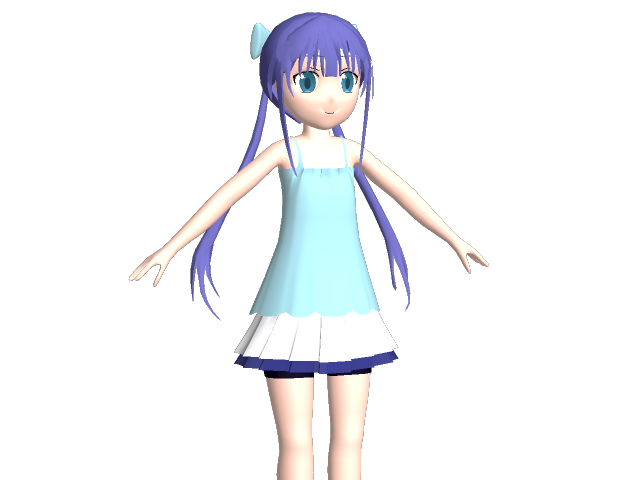

3Dモデル色々
================

モデリング練習用です．人物をちゃんと作るのはほぼ初めてなので試行錯誤しながら．

### 2015-08-15

### 2014-07-20

MMDモデル
----------

生成方法メモ．

1. enju.mqoの曲面をフリーズした上で，enju_bone.mqoを追加
2. メタセコイアのプラグインからpmdをエクスポート
3. PMXEditorで開いて*.csvをゴニョゴニョ

自動化するツールもあとで公開するかもですが，まだしっくりくるやり方が見つかってないのでどうなるかわかりません．

リンク
---------

ニコニ立体：

- http://3d.nicovideo.jp/works/td11358
- http://3d.nicovideo.jp/works/td9914
- http://3d.nicovideo.jp/works/td11011

リポジトリ： 

- https://github.com/binzume/model-enju

