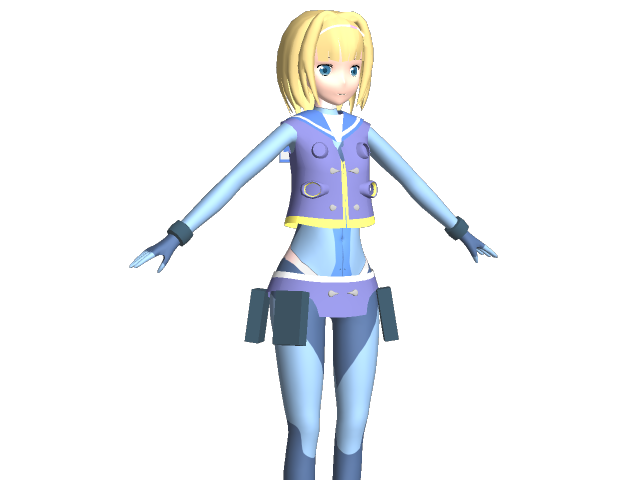

3Dモデル色々
================

モデリング練習用です．人物をちゃんと作るのはほぼ初めてなので試行錯誤しながら．

### 2015-10-14

．．．

ニコニ立体：[td23887](http://3d.nicovideo.jp/works/td23887)

### 2015-08-15

ニコニ立体：[td22327](http://3d.nicovideo.jp/works/td22327)

#### pmdの生成メモ

- マテリアル設定
- 曲面をフリーズ
- ボーンのウェイト設定(身体系とツインテール以外はそのままいけるはず)
- pmdで保存(0.1倍)
- 何かファイルがおかしいっぽいので，PMXEditorで一度開いて保存しなおす

### 2014-07-20

ニコニ立体：[td9914](http://3d.nicovideo.jp/works/td9914) [td11358](http://3d.nicovideo.jp/works/td11358)

MMDモデル
----------

生成方法メモ．

1. enju.mqoの曲面をフリーズした上で，enju_bone.mqoを追加
2. メタセコイアのプラグインからpmdをエクスポート
3. PMXEditorで開いて*.csvをゴニョゴニョ

自動化するツールもあとで公開するかもですが，まだしっくりくるやり方が見つかってないのでどうなるかわかりません．

リンク
---------

リポジトリ： 

- https://github.com/binzume/model-enju

